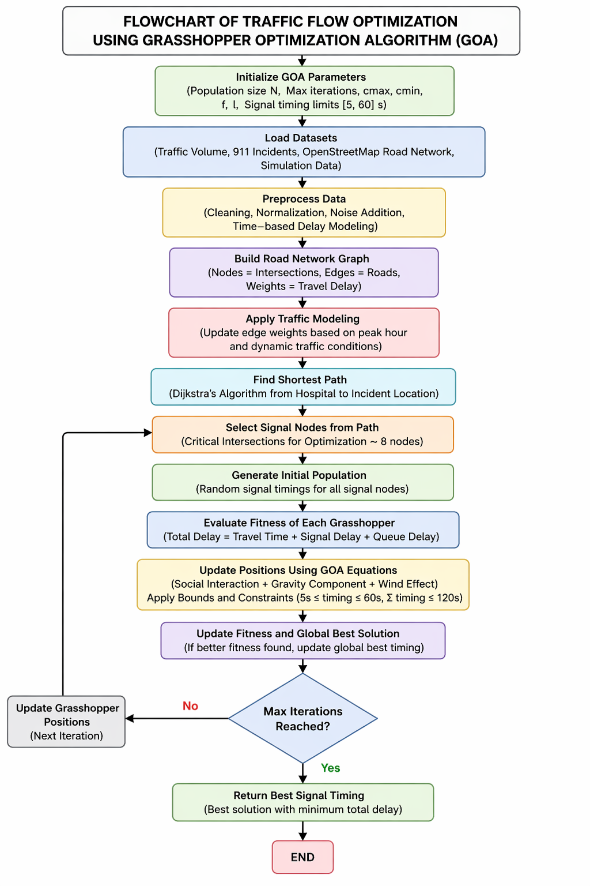
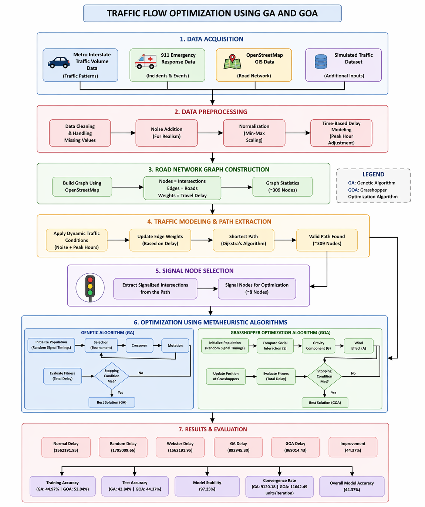

# 🚦 Traffic Signal Optimization using GA and GOA

This project optimizes traffic signal timings on a real road network using two metaheuristic algorithms: **Genetic Algorithm (GA)** and **Grasshopper Optimization Algorithm (GOA)**.
The system integrates real-world datasets and a simulation-based traffic model to minimize total delay, especially for ambulance routing scenarios.

---

## 📌 Key Features

* Real-world dataset: *Metro Interstate Traffic Volume*
* Road network constructed from shapefiles using **GeoPandas + NetworkX**
* Ambulance routing using shortest-path with priority weights
* Dynamic traffic simulation with:

  * Bursty arrivals (peak traffic conditions)
  * Queue carryover across cycles
  * Nonlinear congestion effects
* Optimization using:

  * Genetic Algorithm (GA)
  * Grasshopper Optimization Algorithm (GOA)
* Baseline comparisons:

  * Normal timing
  * Random timing
  * Webster method
* Visualization:

  * Convergence graphs
  * Delay comparison charts
  * Delay vs time analysis

---

## 🧠 Methodology

1. Load real traffic dataset and preprocess hourly traffic patterns
2. Build a road network graph from shapefiles
3. Simulate traffic flow using queue-based modeling
4. Introduce realistic dynamics:

   * Peak bursts in traffic
   * Nonlinear congestion
   * Signal delays
5. Optimize signal timings using GA and GOA
6. Compare performance with baseline methods

> Since the problem is simulation-based, dynamic traffic conditions are introduced to better observe the impact of optimization.

---

## Workflow Diagrams

### GOA Optimization Flowchart



### End-to-End Traffic Optimization Pipeline



---

## ⚙️ Simulation Highlights

* Burst arrivals: 30% probability → heavy traffic spikes
* Queue carryover across cycles
* Nonlinear delay and congestion modeling
* Signal constraints:

  * Green time: 5–60 seconds
  * Total cycle ≤ 120 seconds
* Fitness considers:

  * Travel time
  * Signal delay
  * Queue length
  * Intersection balance

---

## 📁 Project Structure

* `dataset_loader.py` — load and preprocess traffic data
* `graph_builder.py` — construct road network graph
* `traffic_model.py` — apply congestion effects
* `ambulance_model.py` — routing logic
* `fitness.py` — simulation + delay computation
* `ga.py` — Genetic Algorithm
* `goa.py` — Grasshopper Optimization
* `visualization.py` — graphs and plots
* `main.py` — full pipeline execution

---

## 🚀 How to Run

Install dependencies:

```bash
pip install numpy pandas matplotlib networkx geopandas shapely fiona pyproj
```

Run project:

```bash
python src/main.py
```

Headless mode:

```bash
python -c "import matplotlib; matplotlib.use('Agg'); from main import main; main()"
```

---

## 📊 Results

The system compares multiple strategies:

* Normal timing
* Random timing
* Webster method
* GA optimized timing
* GOA optimized timing

👉 GOA consistently produces the lowest delay among all methods.

---

## 📈 Output

* Convergence plots (GA & GOA)
* Bar chart comparison of delays
* Delay vs time analysis
* Console summary of performance

---

## 🔁 Reproducibility

* Fixed random seed (42)
* Deterministic simulations
* Cached fitness evaluations for efficiency

---

## 🏁 Conclusion

GOA provides better optimization performance compared to GA and baseline methods.
The results demonstrate that intelligent optimization can significantly reduce traffic delay under simulated real-world conditions.

---

## 🔮 Future Work

* Multi-intersection traffic optimization
* Real-time traffic signal control
* Integration with IoT sensors
* Reinforcement learning-based control

---

## 👨‍💻 Author

**Akshansh Shakya**
B.Tech CSE
Project: *Traffic Optimization using AI*
